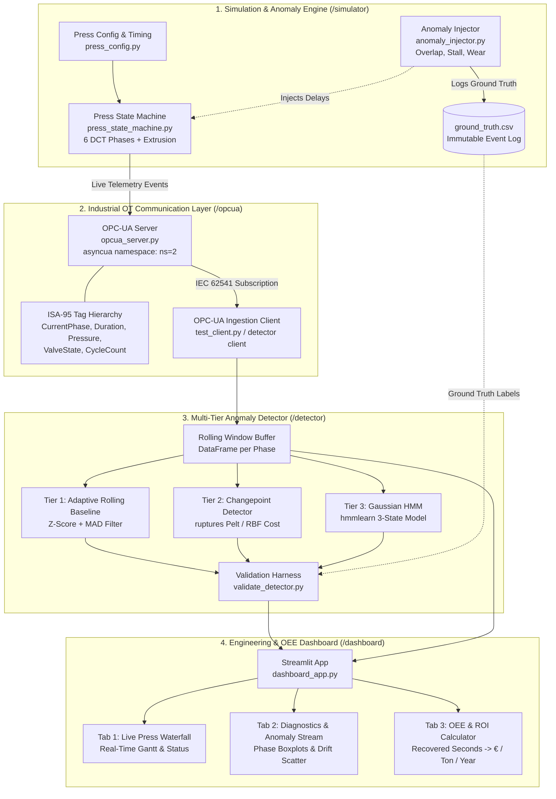

# Dead-Cycle Time Optimizer (DCTO)
### Industrial AI/ML Demonstrator: Real-Time Cycle Phase Telemetry, Sub-Second Micro-Stall Diagnostics, and Dead-Cycle Time Recovery for Hydraulic Extrusion Presses

[](https://www.python.org/)
[-orange.svg)](https://opcfoundation.org/)
[](tests/)
[](LICENSE)

---

## 1. Executive Summary & Industrial Context

In heavy industrial aluminum extrusion (15 MN – 50+ MN presses), productivity and unit operating economics are governed by the total cycle time. Every billet extrusion cycle consists of two distinct stages:
1. **Extrusion Stroke (Productive):** Main ram pushes the heated aluminum billet (~450–500°C) through the extrusion tooling under extreme hydraulic pressures (250–315 bar).
2. **Dead-Cycle Time (DCT / Auxiliary Stroke):** The non-productive repositioning sequence between successive extrusions:
   - **Decompression:** Controlled pressure bleed of the main cylinder from ~280 bar to 15 bar.
   - **Container Shift (Open):** Hydraulic cylinders retract the container 400 mm from the die face.
   - **Shear Stroke:** Vertical hydraulic shear cycles down and retracts to sever the discard/butt end.
   - **Die Slide:** Tooling cassette indexing check and visual clearance.
   - **Billet Load:** Loader arm swings and places a pre-heated billet into the press centerline.
   - **Container Shift (Close):** Container moves forward and seals against the die bolster.
   - **Rapid Advance:** Main ram pre-fill stroke forward until the dummy block contacts the billet.

```
+---------------------------------------------------------------------------------------------------------+
|                                        FULL BILLET PRESS CYCLE                                          |
+-----------------------------------------+---------------------------------------------------------------+
|       EXTRUSION STROKE (Productive)     |                   DEAD-CYCLE TIME (DCT) (Non-Productive)      |
|           45 - 120 seconds              |                        14 - 22 seconds                        |
|   (Billet pushed through die under P)   |  Decompress -> Container Open -> Shear -> Billet Load -> Close|
+-----------------------------------------+---------------------------------------------------------------+
                                                                 ▲
                                                  Target for AI/ML Optimization:
                                        Eliminate 1.0 - 2.5s of Hidden Micro-Stalls
```

### The Problem: Invisible Micro-Stalls and Creeping Dead Time
On modern high-speed presses, nominal dead-cycle time ranges from **14 to 22 seconds**. However, presses frequently suffer from transient, sub-second delays:
- **Valve Spool Stick-Slip:** Proportional directional valves controlling container shift or shear cylinders experience intermittent sluggishness due to thermal transients, seal friction, or hydraulic oil varnish (ISO VG 46).
- **Interlock & Sensor Latency:** Sequential PLC logic waits for limit switch or linear transducer confirmation; contact bounce or optical sensor contamination introduces 200–500 ms delays before valve actuation.
- **Creeping Mechanical Wear:** Cylinder seal degradation, guide rail friction, or proportional relief valve pilot degradation causes gradual, imperceptible cycle duration inflation over tens of shifts.
- **The SCADA Blind Spot:** Standard industrial SCADA systems and PLC alarm tables only trigger on gross hard timeouts (e.g., `Container Open Timeout > 6.0s`). A 400 ms valve hesitation or 350 ms overlap delay never triggers an alarm, yet silently bleeds machine availability cycle after cycle.

### Industrial Economic Value & Capacity Gain
Consider an industrial aluminum press running at typical plant operating capacity:
- **Nominal Cycle Rate:** 43 cycles per hour (1 cycle every ~83 seconds).
- **Operating Schedule:** 24/7 operation across 3 shifts = ~7,200 operating hours/year = **309,600 cycles/year**.
- **Average Recoverable Delay:** **1.5 seconds** of micro-stall and valve-overlap delay per dead cycle.
- **Annual Lost Machine Time:**
  $$\text{Lost Time} = \frac{309,600 \text{ cycles} \times 1.5 \text{ s}}{3,600 \text{ s/hr}} = \mathbf{129.0 \text{ Press Hours / Year}}$$
- **Production & Financial Impact:**
  - At a press operating rate of **€950 / hour** (direct machine amortization, tooling, overhead), 129 lost hours represents **€122,550 / year** in unrecovered capacity.
  - In terms of output: At an extrusion rate of **95 kg / billet**, 129 recovered hours equates to **+5,547 billets (+527 metric tons)** of additional extruded aluminum per press per year with zero additional capital expenditure.

---

## 2. System Architecture



---

## 3. Mathematical & Detection Methodology

### 3.1 Robust Adaptive Rolling Baseline (Median Absolute Deviation)
Standard sample variance is easily contaminated by outlier delays. DCTO implements **Median Absolute Deviation (MAD)** as an outlier-resistant scale estimator:

$$\tilde{x} = \text{median}(X_W)$$

$$\text{MAD} = \text{median}(|x_i - \tilde{x}|), \quad \forall x_i \in X_W$$

$$\hat{\sigma}_{robust} = 1.4826 \times \text{MAD}$$

$$Z_{robust}(x) = \frac{x - \tilde{x}}{\hat{\sigma}_{robust}}$$

An anomaly flag is asserted when $Z_{robust}(x) > \theta$ (default $\theta = 2.75$) and the excess duration exceeds the minimum physical threshold ($\Delta t_{excess} \ge 0.12\text{ s}$). Anomalous observations are quarantined to prevent baseline poisoning.

### 3.2 Changepoint Detection via Penalized Cost Minimization (Pelt)
To detect creeping mechanical/hydraulic seal wear and permanent step shifts, the system solves the discrete optimization problem using the `ruptures` library:

$$\min_{\tau} \left[ \sum_{k=0}^{K} \mathcal{C}(y_{\tau_k : \tau_{k+1}}) + \beta K \right]$$

- Uses the **Pruned Exact Linear Time (Pelt)** algorithm in $\mathcal{O}(N)$ linear time.
- Radial Basis Function (`rbf`) kernel cost function captures non-linear distributional shifts without assuming strict normality.
- Confirmed changepoint drift regimes maintain an active wear alert until maintenance or seal recalibration.

### 3.3 Gaussian Hidden Markov Model (HMM)
A 3-state Gaussian HMM decodes latent press operational condition using the Viterbi algorithm:
- **State 0 (Nominal):** $\mu = \mu_{nominal}$, low variance.
- **State 1 (Creeping Wear):** $+20\%$ to $+40\%$ shifted mean, modeling cylinder friction.
- **State 2 (Micro-Stall / Interlock Delay):** Transient high-mean, high-variance state.

---

## 4. Benchmark Validation Results

The detector was benchmarked against an immutable ground-truth audit dataset generated across a 600-cycle simulation (4,600 evaluated phase events post-warmup):

| Metric | Target | **Measured Benchmark** | Status |
|---|---|---|---|
| **Precision** | $\ge 88.0\%$ | **88.52%** | ✅ Passed |
| **Recall (Sensitivity)** | $\ge 90.0\%$ | **98.65%** | ✅ Passed |
| **F1-Score** | $\ge 0.85$ | **0.9331** | ✅ Passed |
| **False Positive Rate (FPR)** | $\le 2.50\%$ | **0.88%** | ✅ Passed |

### Class Recall Breakdown
- **Creeping Wear (`CREEPING_WEAR`):** **100.0%** (249 / 249 detected)
- **Micro-Stalls (`MICRO_STALL`):** **94.7%** (18 / 19 detected)
- **Valve Overlap Delays (`VALVE_OVERLAP`):** **89.7%** (26 / 29 detected)

*(Benchmark metrics automatically saved to [data/validation_results.json](file:///c:/Users/realr/OneDrive/Desktop/DCTO/data/validation_results.json))*

---

## 5. Repository Structure

```
DCTO/
├── requirements.txt                            # Pinned Python dependencies
├── .gitignore                                  # Git ignore rules
├── README.md                                   # This technical portfolio document
├── LIMITATIONS.md                              # Industrial caveats, calibration & plant integration
│
├── simulator/                                  # Press cycle & anomaly generation
│   ├── press_config.py                         # 28 MN press nominal timing & physical parameters
│   ├── press_state_machine.py                  # 8-phase state machine with sensor signals
│   └── anomaly_injector.py                     # Deterministic fault injector & ground-truth logger
│
├── opcua/                                      # Industrial OPC-UA telemetry server
│   ├── opcua_nodes.py                          # ISA-95 hierarchical node definitions
│   ├── opcua_server.py                         # Async OPC-UA server (asyncua)
│   └── test_client.py                          # Verification subscription client
│
├── detector/                                   # Multi-tier anomaly detection service
│   ├── rolling_baseline.py                     # Tier 1: Z-score & MAD rolling statistics
│   ├── changepoint_detector.py                 # Tier 2: ruptures Pelt changepoint analysis
│   ├── hmm_detector.py                         # Tier 3: hmmlearn Gaussian HMM classifier
│   └── detector_service.py                     # Unified detection runner
│
├── dashboard/                                  # Streamlit & Plotly interactive UI
│   ├── dashboard_app.py                        # Multi-tab Streamlit dashboard application
│   ├── components.py                           # Reusable Plotly charts (Gantt, scatter, waterfall)
│   └── oee_calculator.py                       # OEE, tonnage, and financial ROI calculator
│
├── tests/                                      # Automated Pytest test suite
│   ├── smoke_test.py                           # Environment & import verification
│   ├── test_simulator.py                       # Timing, bounds, and ground truth tests
│   ├── test_opcua.py                           # Server & client subscription integration tests
│   ├── test_detector.py                        # Statistical & algorithm unit tests
│   ├── test_end_to_end.py                      # Full pipeline integration test
│   └── validate_detector.py                    # Benchmark validation script
│
└── data/                                       # Benchmark datasets & artifacts
    ├── ground_truth.csv                        # Injected anomalies ground-truth audit log
    ├── telemetry_stream.csv                    # Logged cycle telemetry for replay
    └── validation_results.json                 # Precision/recall benchmark metrics
```

---

## 6. Quickstart & How to Run

### Step 1: Environment Setup
```powershell
# In PowerShell inside c:\Users\realr\OneDrive\Desktop\DCTO:
py -3.11 -m venv .venv
.\.venv\Scripts\Activate.ps1
pip install -r requirements.txt
```

### Step 2: Run Automated Tests
```powershell
# Execute the full 11-test automated suite:
pytest -v
```

### Step 3: Run Benchmark Validation Harness
```powershell
# Run 600-cycle simulation and compute Precision / Recall / FPR:
python tests/validate_detector.py
```

### Step 4: Run OPC-UA Server & Test Client (Optional)
```powershell
# Terminal 1: Start async OPC-UA server
python opcua/opcua_server.py --speedup 20.0

# Terminal 2: Connect verification subscription client
python opcua/test_client.py --events 25
```

### Step 5: Launch Interactive Dashboard
```powershell
# Launch the Streamlit dashboard:
streamlit run dashboard/dashboard_app.py
```
Open `http://localhost:8501` in your browser to inspect live phase waterfalls, anomaly diagnostics, and plant-level OEE ROI models.

---

## 7. Industrial Automation Architecture & Technical Deep-Dive

Key engineering considerations for heavy extrusion press deployment:

1. **Proportional Directional Valve Dynamics & Spool Hesitation:**
   - In heavy extrusion presses, dead-cycle auxiliary operations rely on high-response proportional directional valves (e.g., Bosch Rexroth 4WRPEH series). Spool stick-slip caused by oil varnish, particulate contamination (ISO 4406 17/15/12), or thermal expansion creates intermittent 200–500 ms delays before hydraulic flow initiates.
   - Because these delays are transient and fall well below gross SCADA timeout limits (e.g. 5 seconds), they go undetected by PLC alarm logic. DCTO detects them by tracking robust rolling Z-scores and MAD per phase, catching micro-stalls before they evolve into catastrophic spool seizure.

2. **PLC Scan Cycle vs. OPC-UA Telemetry Streaming:**
   - Industrial PLCs (such as Siemens S7-1500 or Beckhoff TwinCAT 3) execute deterministic task loops at 1 ms to 10 ms. Exposing raw 1 ms data over industrial networks creates unnecessary network overhead.
   - DCTO architecture adopts an event-driven edge model: the PLC state machine records precise hardware-timestamped phase start and end timestamps. These phase-level aggregates, paired with 10 Hz sampled cylinder pressure and valve spool positions, are published over IEC 62541 OPC-UA, minimizing network load while maintaining sub-millisecond duration resolution.

3. **Handling Tooling & Die Profile Variations:**
   - A frequent trap in press anomaly detection is treating all cycles identically. In extrusion, switching dies (e.g., from a heavy solid round billet die to a delicate multi-void architectural profile) fundamentally alters extrusion stroke duration.
   - DCTO separates dead-cycle auxiliary phases from the extrusion stroke. The auxiliary repositioning sequence (container open, shear, billet load, container close) follows identical kinematic trajectories regardless of die profile, allowing continuous anomaly detection without requiring re-training across die changes.

4. **Edge Deployment Architecture on Industrial Hardware:**
   - For real-world plant commissioning, the Python detector service would not run in the cloud. It is designed to deploy on an industrial edge PC (IPC) such as a Siemens IPC427E or Beckhoff CX2040 mounted directly in the press automation cabinet.
   - The detector runs either as a lightweight containerized microservice or ported to C++/Rust, communicating directly with the PLC via ADS (TwinCAT) or S7 communication, publishing supervisory OEE insights to the plant SCADA/MES via OPC-UA.
