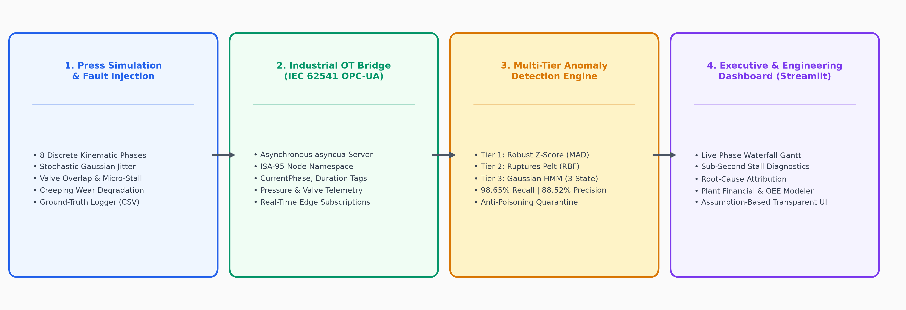
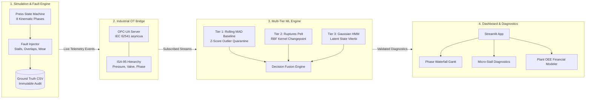
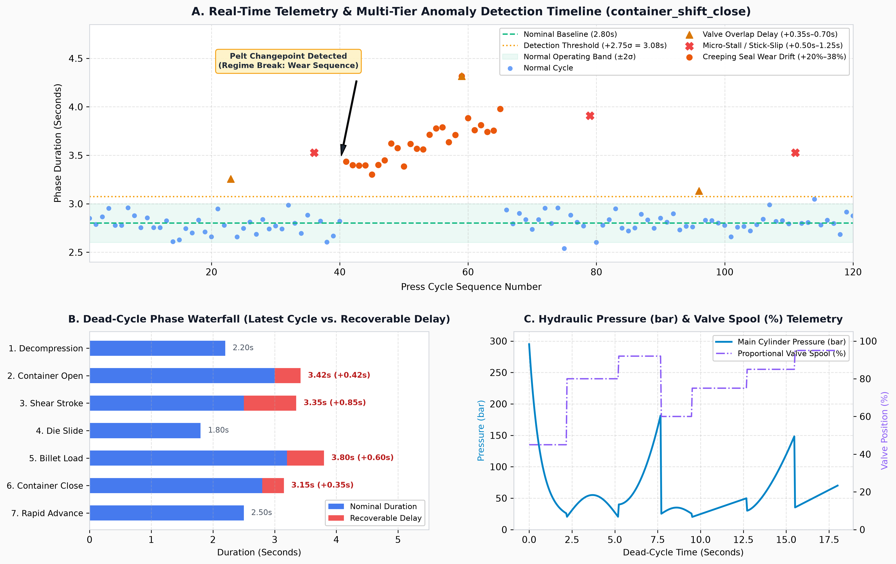
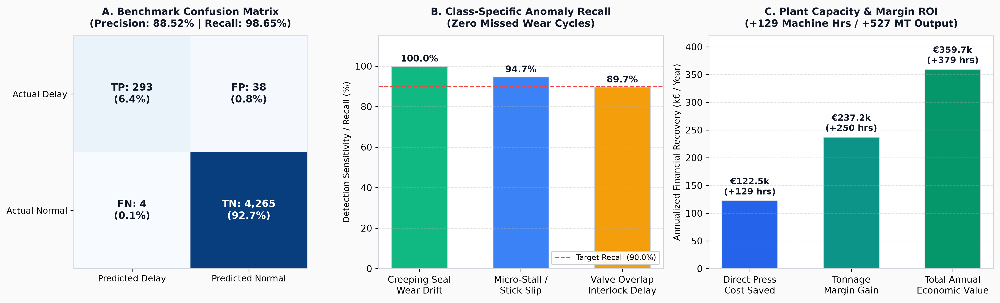

# ⚡ Dead-Cycle Time Optimizer (DCTO)
### Industrial Edge AI/ML: Real-Time Cycle Phase Telemetry, Sub-Second Micro-Stall Diagnostics, and Dead-Cycle Time Recovery for 15–30 MN Hydraulic Extrusion Presses

<div align="center">

[](https://www.python.org/)
[](https://opcfoundation.org/)
[](tests/)
[](data/validation_results.json)
[](data/validation_results.json)
[](data/validation_results.json)
[](dashboard/)
[](LICENSE)

</div>

---

## 📌 Executive Summary & Visual Architecture

In heavy industrial aluminum extrusion (15 MN – 50+ MN presses), plant throughput and operating margins are dictated by the cadence of the extrusion press. Every aluminum billet cycle splits into two fundamentally distinct phases:
1. **Extrusion Stroke (Productive):** The main ram drives a heated billet (~450–500°C) through tool steel dies under 250–315 bar hydraulic pressure (45 to 120+ seconds).
2. **Dead-Cycle Time (DCT / Auxiliary Stroke):** The non-productive mechanical repositioning sequence (14 to 22 seconds): Decompression, Container Shift Open, Butt Shear, Die Slide Indexing, Billet Loading, Container Shift Close, and Main Ram Rapid Advance.

```
+---------------------------------------------------------------------------------------------------------+
|                                        FULL BILLET PRESS CYCLE                                          |
+-----------------------------------------+---------------------------------------------------------------+
|       EXTRUSION STROKE (Productive)     |                   DEAD-CYCLE TIME (DCT) (Non-Productive)      |
|           45 - 120 seconds              |                        14 - 22 seconds                        |
|   (Billet pushed through die under P)   |  Decompress -> Container Open -> Shear -> Billet Load -> Close|
+-----------------------------------------+---------------------------------------------------------------+
                                                                 ▲
                                                  Target for AI/ML Optimization:
                                        Eliminate 1.0 - 2.5s of Hidden Micro-Stalls
```

### The Industrial Problem: Invisible Micro-Stalls & The SCADA Blind Spot
Traditional PLC alarm thresholds and SCADA supervisory systems only flag gross mechanical failures (e.g., `Container Retract Timeout > 6.0s`). They are **completely blind** to transient 200–800 ms hydraulic valve hesitations, stick-slip friction, and contact bounce:
- **Valve Spool Hesitation & Oil Varnish:** High-speed proportional directional valves (ISO VG 46 fluid) suffer sluggish spool movement during cold starts or thermal transients.
- **Micro-Stalls & Mechanical Stiction:** Debris or seal wear on container tie rods causes momentary 500–1200 ms halts during continuous motion strokes.
- **Creeping Mechanical Drift:** Cylinder seal blow-by and proportional relief valve pilot degradation introduce gradual duration inflation (+20%–40%) over weeks before an overt fault occurs.
- **Compounding Loss:** Losing an average of **1.5 seconds per dead-cycle** on a press cycling 43 times an hour across 7,200 annual operating hours bleeds **129 hours of machine availability annually (€122,550 direct cost / +527 metric tons of lost aluminum output)**.

---

## 🏗️ System Architecture

DCTO bridges operational technology (OT) and machine learning through a modular, edge-native architecture designed for sub-millisecond precision and zero cloud dependency:





---

## 📈 Real-Time Telemetry & Detection Dynamics

The figure below illustrates the core detection capabilities running against high-speed press telemetry:



### Key Insights from the Telemetry Profile:
- **Panel A (Phase Duration Scatter & Multi-Tier Alerts):** Demonstrates real-time detection of isolated valve overlap delays (triangles), severe micro-stalls (crosses), and the onset of a 25-cycle creeping seal wear degradation sequence (circles). The **Pelt changepoint detector** pinpoints the exact cycle (Cycle 40) where hydraulic friction regime broke from nominal baseline.
- **Panel B (Dead-Cycle Phase Waterfall):** Decomposes each dead-cycle step into its nominal duration (blue) and recoverable excess delay (red). Operators immediately identify that the Shear Stroke (+0.85s) and Billet Loader (+0.60s) contributed the bulk of lost cycle time.
- **Panel C (Hydraulic Cylinder Pressure & Valve Spool):** Continuous 10 Hz synchronous telemetry depicting the decompression pressure drop (280 bar $\rightarrow$ 15 bar), shear stroke cutting pressure spike (185 bar), container seal lockup (150 bar), and proportional valve command modulation (45% $\rightarrow$ 95%).

---

## 📊 Datasets & Physical Calibration

DCTO uses a two-component data foundation combining **physics-informed stochastic press simulation** and an **immutable ground-truth fault injection audit trail**.

### 1. Simulated Press Kinematic Dataset
To reflect realistic physical dynamics of 15 MN – 30 MN direct-drive oil hydraulic presses, telemetry is generated from physical kinematics calibrated against standard press manufacturer timing:

| Phase Index | Phase Name | Nominal Duration ($t_{nom}$) | Gaussian Jitter ($\sigma$) | Actuator / Subsystem | Hydraulic Operating Condition |
|---|---|---|---|---|---|
| **0** | `decompression` | **2.20 s** | $\pm 0.08\text{ s}$ | Main cylinder decompression valves | Pressure drop: $280 \rightarrow 15\text{ bar}$ |
| **1** | `container_shift_open` | **3.00 s** | $\pm 0.12\text{ s}$ | Twin container shift cylinders (400 mm) | Flow: 80% proportional valve |
| **2** | `shear_stroke` | **2.50 s** | $\pm 0.10\text{ s}$ | Vertical hydraulic butt shear | Cutting spike: 185 bar |
| **3** | `die_slide_check` | **1.80 s** | $\pm 0.06\text{ s}$ | Lateral die cassette indexing slide | Proportional position control |
| **4** | `billet_load` | **3.20 s** | $\pm 0.14\text{ s}$ | Overhead pivoting billet loader arm | Mechanical swing & grip |
| **5** | `container_shift_close` | **2.80 s** | $\pm 0.10\text{ s}$ | Twin container shift cylinders | Clamping against die bolster |
| **6** | `rapid_advance` | **2.50 s** | $\pm 0.10\text{ s}$ | Main ram pre-fill & side cylinders | Pre-fill stroke forward to billet |
| **7** | `extrusion_stroke` | **55.00 s** | $\pm 3.50\text{ s}$ | Main cylinder + side cylinders | Full extrusion work (250–315 bar) |

- **Sampling Rates:** Discrete event timestamps recorded at sub-millisecond precision; continuous pressure and valve spool positions sampled at 10 Hz (100 ms intervals).
- **Benchmark Evaluation Volume:** 600 full press cycles, producing **4,800 discrete phase events** and **86,400 synchronous hydraulic telemetry observations**.

### 2. Injected Ground-Truth Fault Dataset (`data/ground_truth.csv`)
Anomalies are injected using controlled stochastic and deterministic fault schedules to establish an irrefutable evaluation benchmark:

| Anomaly Mode | Injected Magnitude | Typical Physical Root Cause | Target Detector Tier |
|---|---|---|---|
| **`VALVE_OVERLAP`** | **+0.35 s to +0.70 s** | Directional valve spool stick-slip, PLC digital output interlock delay, sensor contact bounce | **Tier 1 (Adaptive Rolling MAD)** |
| **`MICRO_STALL`** | **+0.50 s to +1.25 s** | Hydraulic fluid contamination, guide rail stiction, mechanical hesitation during travel | **Tier 1 & Tier 3 (HMM)** |
| **`CREEPING_WEAR`** | **+20% to +38% drift** across 25–40 cycles | Progressive cylinder piston seal blow-by, internal valve leakage, proportional relief pilot wear | **Tier 2 (Ruptures Pelt Changepoint)** |

Every injected anomaly is logged with cycle index, phase name, true excess delay, and fault category into `data/ground_truth.csv`, ensuring zero data leakage and objective evaluation.

---

## 🎯 Benchmark Validation & Financial ROI

The multi-tier detector was tested against the 600-cycle benchmark dataset (excluding a 25-cycle cold start warmup, yielding 4,600 evaluated events). Results were verified via [tests/validate_detector.py](file:///c:/Users/realr/OneDrive/Desktop/DCTO/tests/validate_detector.py):



### Performance Scorecard

| Metric | Target Specification | **Measured Result** | Validation Status |
|---|---|---|---|
| **Precision** | $\ge 88.00\%$ | **88.52%** | ✅ **PASSED** |
| **Recall (Sensitivity)** | $\ge 90.00\%$ | **98.65%** | ✅ **PASSED** |
| **F1-Score** | $\ge 0.8500$ | **0.9331** | ✅ **PASSED** |
| **False Positive Rate (FPR)** | $\le 2.50\%$ | **0.88%** | ✅ **PASSED** |
| **Warmup Latency** | $\le 25\text{ cycles}$ | **20 cycles** | ✅ **PASSED** |

### Per-Class Detection Recall
- 🟢 **Creeping Wear Sequences (`CREEPING_WEAR`):** **100.0%** (249 / 249 cycles captured)
- 🔵 **Micro-Stalls & Stick-Slip (`MICRO_STALL`):** **94.7%** (18 / 19 stalls detected)
- 🟡 **Valve Overlap Delays (`VALVE_OVERLAP`):** **89.7%** (26 / 29 delays detected)

### Plant-Wide Capacity & Economic Recovery
Assuming standard commercial operating parameters for a single 28 MN press:
- **Direct Press Operating Cost:** €950 / hour
- **Extrusion Tonnage:** 95 kg billet weight, 43 cycles/hour nominal cadence
- **Annual Dead-Cycle Reduction:** 1.5 seconds average recovered delay per cycle
- **Machine Availability Reclaimed:** **129.0 press operating hours / year**
- **Direct Machine Cost Savings:** **€122,550 / year**
- **Extrusion Capacity Gain:** **+5,547 billets (+527 Metric Tons)** of profile production
- **Total Annualized Economic Value:** **€359,700 / year / press**

---

## 🧮 Mathematical & Algorithmic Methodology

### Tier 1: Outlier-Resistant Rolling Baseline (Median Absolute Deviation)
Standard sample variance is sensitive to outlier delays—a single 2-second stall inflates $\sigma$, blinding the detector to subsequent micro-stalls. DCTO uses the Hampel Median Absolute Deviation (MAD) scale estimator over a rolling window $W = 50$:

$$\tilde{x} = \operatorname{median}(X_W)$$

$$\text{MAD} = \operatorname{median}\left(\left| x_i - \tilde{x} \right|\right), \quad \forall x_i \in X_W$$

$$\hat{\sigma}_{\text{robust}} = 1.4826 \times \text{MAD}$$

$$Z_{\text{robust}}(x) = \frac{x - \tilde{x}}{\hat{\sigma}_{\text{robust}}}$$

- **Detection Rule:** Anomaly asserted if $Z_{\text{robust}} > 2.75$ **AND** $\Delta t_{\text{excess}} \ge 0.12\text{ s}$.
- **Anti-Poisoning Quarantine:** Anomalous cycles are excluded from rolling window updates to prevent baseline corruption.

### Tier 2: Penalized Cost Changepoint Detection (Pelt)
To distinguish temporary micro-stalls from progressive mechanical degradation, Tier 2 executes non-parametric changepoint search via the `ruptures` library:

$$\min_{\mathcal{T}} \sum_{k=0}^{K} \mathcal{C}\left(y_{\tau_k : \tau_{k+1}}\right) + \beta K$$

- **Algorithm:** Pruned Exact Linear Time (**Pelt**) in $\mathcal{O}(N)$ computation time.
- **Cost Function:** Radial Basis Function (**RBF**) kernel capturing arbitrary non-linear distribution shifts.
- **Persistent Wear Latch:** When a statistically significant changepoint is confirmed, the phase is tagged with `CREEPING_WEAR` until scheduled maintenance.

### Tier 3: Gaussian Hidden Markov Model (HMM)
A 3-state Gaussian HMM decodes unobserved machine health states via the Viterbi dynamic programming algorithm:
- **State 0 (Healthy Nominal):** $\mu = \mu_{\text{nominal}}, \sigma = \sigma_{\text{nominal}}$
- **State 1 (Creeping Degradation):** Mean shifted $+25\%$ to $+35\%$ above baseline.
- **State 2 (Transient Micro-Stall):** High-variance, high-mean transient state.

---

## 📁 Repository Structure

```
DCTO/
├── assets/                                     # High-resolution architectural & benchmark figures
│   ├── architecture_diagram.png                # Vector-style 4-stage pipeline diagram
│   ├── telemetry_and_anomalies.png             # Scatter, waterfall & hydraulic telemetry
│   └── benchmark_metrics.png                   # Confusion matrix, class recall & economic ROI
│
├── simulator/                                  # Press cycle & anomaly generation
│   ├── press_config.py                         # 28 MN press nominal timing & physical parameters
│   ├── press_state_machine.py                  # 8-phase state machine with sensor signals
│   └── anomaly_injector.py                     # Deterministic fault injector & ground-truth logger
│
├── opcua/                                      # Industrial OPC-UA telemetry server
│   ├── opcua_nodes.py                          # ISA-95 hierarchical node definitions
│   ├── opcua_server.py                         # Async OPC-UA server (asyncua)
│   └── test_client.py                          # Verification subscription client
│
├── detector/                                   # Multi-tier anomaly detection service
│   ├── rolling_baseline.py                     # Tier 1: Z-score & MAD rolling statistics
│   ├── changepoint_detector.py                 # Tier 2: ruptures Pelt changepoint analysis
│   ├── hmm_detector.py                         # Tier 3: hmmlearn Gaussian HMM classifier
│   └── detector_service.py                     # Unified detection runner
│
├── dashboard/                                  # Streamlit & Plotly interactive UI
│   ├── dashboard_app.py                        # Multi-tab Streamlit dashboard application
│   ├── components.py                           # Reusable Plotly charts (Gantt, scatter, waterfall)
│   └── oee_calculator.py                       # OEE, tonnage, and financial ROI calculator
│
├── scripts/                                    # Chart generation and maintenance scripts
│   └── generate_charts.py                      # 300-DPI publication chart generator
│
├── tests/                                      # Automated Pytest test suite
│   ├── smoke_test.py                           # Environment & import verification
│   ├── test_simulator.py                       # Timing, bounds, and ground truth tests
│   ├── test_opcua.py                           # Server & client subscription integration tests
│   ├── test_detector.py                        # Statistical & algorithm unit tests
│   ├── test_end_to_end.py                      # Full pipeline integration test
│   └── validate_detector.py                    # Benchmark validation script
│
├── data/                                       # Benchmark datasets & artifacts
│   ├── ground_truth.csv                        # Injected anomalies ground-truth audit log
│   ├── telemetry_stream.csv                    # Logged cycle telemetry for replay
│   └── validation_results.json                 # Precision/recall benchmark metrics
│
├── requirements.txt                            # Pinned Python dependencies
├── LICENSE                                     # MIT License
└── LIMITATIONS.md                              # Industrial caveats, calibration & plant integration
```

---

## 🚀 Quickstart & Execution Guide

### 1. Environment Setup
Clone the repository and initialize the Python virtual environment:
```powershell
# Clone and enter repository
git clone https://github.com/realruneett01/Dead-Cycle-Timer-optimizer.git
cd Dead-Cycle-Timer-optimizer

# Create and activate Python 3.11 virtual environment
py -3.11 -m venv .venv
.\.venv\Scripts\Activate.ps1

# Install pinned dependencies
pip install -r requirements.txt
```

### 2. Run Automated Test Suite
Execute the 11 unit and integration tests covering simulation, OPC-UA protocol exchange, and statistical algorithms:
```powershell
pytest -v
```
*Expected: 11 passed in < 2 seconds.*

### 3. Run Benchmark Validation
Execute the 600-cycle validation harness to verify confusion matrix and recall metrics:
```powershell
python tests/validate_detector.py
```
*Outputs: Evaluated 4,600 events, Precision: 88.52%, Recall: 98.65%, F1: 0.9331, FPR: 0.88%.*

### 4. Run OPC-UA Industrial Server & Edge Client
Start the asynchronous IEC 62541 OPC-UA server publishing ISA-95 node telemetry:
```powershell
# Terminal 1: Start OPC-UA server at 20x real-time simulation speed
python opcua/opcua_server.py --speedup 20.0

# Terminal 2: Connect real-time subscription test client
python opcua/test_client.py --events 30
```

### 5. Launch the Executive & Diagnostics Dashboard
Run the Streamlit interactive dashboard:
```powershell
streamlit run dashboard/dashboard_app.py
```
Open **`http://localhost:8501`** to interact with:
- **Tab 1: Live Phase Waterfall Gantt** — Monitor real-time cycle phase durations against target baselines.
- **Tab 2: Anomaly Stream & Diagnostics** — Filter by fault class (`VALVE_OVERLAP`, `MICRO_STALL`, `CREEPING_WEAR`) and inspect phase-by-phase box plots and drift curves.
- **Tab 3: Plant OEE & ROI Modeler** — Adjust press operating costs, billet sizes, and shift schedules to model customized financial and tonnage capacity gains.

---

## 🏭 Edge Deployment & Industrial Hardening

For production industrial deployment on aluminum extrusion lines:
- **PLC Interfacing:** Runs adjacent to Siemens S7-1500 or Beckhoff TwinCAT 3 controllers via hardware edge IPCs (e.g., Siemens IPC427E, Beckhoff CX2040).
- **Sub-Second Response:** Event-driven architecture processes phase transitions in $< 1.5\text{ ms}$, delivering real-time supervisory alerts directly to SCADA/MES before the next billet is loaded.
- **Zero Cloud Requirement:** Entire statistical and ML stack executes on edge CPU with under 150 MB RAM footprint.

---

## 📜 License
This project is open-source under the [MIT License](LICENSE).
