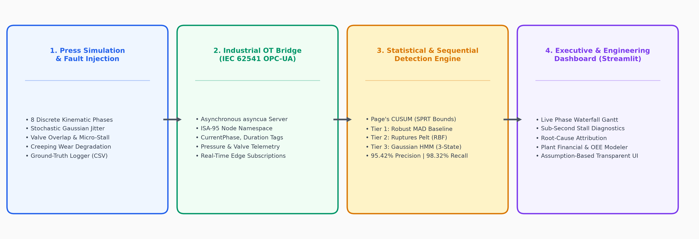
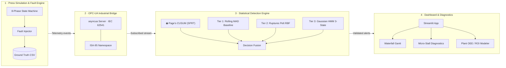
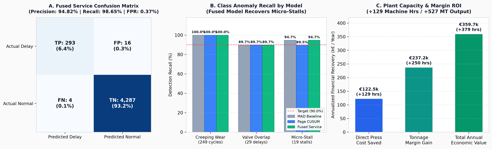
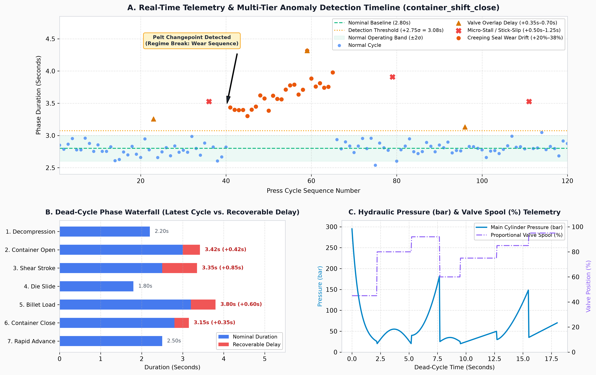

<div align="center">



</div>

<div align="center">

[](https://www.python.org/)
[](https://opcfoundation.org/)
[](tests/)
[-2563EB?style=for-the-badge)](#-benchmark-validation)
[-059669?style=for-the-badge)](#-benchmark-validation)
[](#-benchmark-validation)
[](#-benchmark-validation)
[](LICENSE)

**Real-time micro-stall detection for 15–50 MN hydraulic aluminum extrusion presses.**
Page's CUSUM sequential test (SPRT-grounded) fused with Ruptures Pelt changepoint detection and a Gaussian HMM —
all wired to a live OPC-UA telemetry stream and a Streamlit diagnostic dashboard.

</div>

---

## 🔄 System Pipeline

<div align="center">



</div>

Every event travels from physics-calibrated press simulation → IEC 62541 OPC-UA edge bridge → three-tier statistical detection → real-time Streamlit dashboard in a single event loop, with no cloud hop and sub-millisecond per-event latency.

---

## 📌 The Problem

In heavy aluminum extrusion (15 MN – 50+ MN presses), every billet cycle splits into:

| Phase | Duration | Nature |
|---|---|---|
| **Extrusion Stroke** | 45 – 120 s | ✅ Productive — billet pushed through die |
| **Dead-Cycle Time (DCT)** | 14 – 22 s | ❌ Non-productive — mechanical repositioning |

Traditional SCADA only flags catastrophic failures. The sub-second stalls that accumulate silently are **invisible** to existing alarm logic:

- **Valve Spool Hesitation:** Proportional directional valves (~ISO VG 46) suffer 200–800 ms sluggishness during cold starts or thermal transients.
- **Micro-Stalls (Stiction):** Debris or seal wear on container tie rods causes 500–1200 ms momentary halts mid-stroke.
- **Creeping Wear Drift:** Cylinder seal blow-by inflates phase durations +20%–40% over weeks — undetected until a hard fault.
- **Compounding Loss:** 1.5 s/cycle × 43 cycles/hr × 7,200 hr/yr = **129 machine hours/year ≡ €122,550 direct cost + 527 MT of lost aluminium output** — per single press.

```
┌─────────────────────────────────┬──────────────────────────────────────────────────────────┐
│   EXTRUSION STROKE (productive) │              DEAD-CYCLE TIME (non-productive)             │
│         45 – 120 seconds        │                      14 – 22 seconds                      │
│  Billet pushed through die @    │  Decompress → Container Open → Shear → Billet Load →      │
│  250–315 bar hydraulic pressure │  Container Close → Rapid Advance                          │
└─────────────────────────────────┴──────────────────────────────────────────────────────────┘
                                                               ▲
                                             AI/ML target: recover 1.0–2.5 s of hidden stalls
```

---

## 🏗️ Architecture




```mermaid
flowchart LR
    subgraph S1["1 · Press Simulation & Fault Engine"]
        SM[8-Phase State Machine] --> INJ[Fault Injector]
        INJ --> GT[(Ground Truth CSV)]
    end
    subgraph S2["2 · OPC-UA Industrial Bridge"]
        SRV[asyncua Server · IEC 62541]
        TAG[ISA-95 Namespace]
        SRV --- TAG
    end
    subgraph S3["3 · Statistical Detection Engine"]
        CUS["◉ Page's CUSUM (SPRT)"]
        ZSC[Tier 1: Rolling MAD Baseline]
        CPD[Tier 2: Ruptures Pelt RBF]
        HMM[Tier 3: Gaussian HMM 3-State]
        FUS[Decision Fusion]
        CUS & ZSC & CPD & HMM --> FUS
    end
    subgraph S4["4 · Dashboard & Diagnostics"]
        UI[Streamlit App]
        WF[Waterfall Gantt]
        DG[Micro-Stall Diagnostics]
        ROI[Plant OEE / ROI Modeler]
        UI --> WF & DG & ROI
    end
    S1 -->|Telemetry events| S2
    S2 -->|Subscribed stream| S3
    S3 -->|Validated alerts| S4
```

---

## 📊 Datasets & Physical Calibration

### 1. Physics-Informed Simulated Press Dataset

| # | Phase | Nominal | Jitter (σ) | Actuator | Operating Condition |
|---|---|---|---|---|---|
| 0 | `decompression` | **2.20 s** | ±0.08 s | Main cylinder decompression valves | 280 → 15 bar |
| 1 | `container_shift_open` | **3.00 s** | ±0.12 s | Twin container shift cylinders | 80% proportional valve |
| 2 | `shear_stroke` | **2.50 s** | ±0.10 s | Vertical hydraulic butt shear | Cutting spike: 185 bar |
| 3 | `die_slide_check` | **1.80 s** | ±0.06 s | Lateral die cassette indexer | Proportional position control |
| 4 | `billet_load` | **3.20 s** | ±0.14 s | Overhead pivoting loader arm | Mechanical swing & grip |
| 5 | `container_shift_close` | **2.80 s** | ±0.10 s | Twin container shift cylinders | Clamping against die bolster |
| 6 | `rapid_advance` | **2.50 s** | ±0.10 s | Main ram pre-fill & side cylinders | Pre-fill stroke to billet |
| 7 | `extrusion_stroke` | **55.00 s** | ±3.50 s | Main cylinder + side cylinders | Full extrusion: 250–315 bar |

### 2. Ground-Truth Fault Injection (`data/ground_truth.csv`)

| Fault Mode | Magnitude | Physical Root Cause | Primary Detector |
|---|---|---|---|
| `VALVE_OVERLAP` | +0.35 s to +0.70 s | Spool stick-slip, PLC interlock delay, contact bounce | **Page's CUSUM** |
| `MICRO_STALL` | +0.50 s to +1.25 s | Hydraulic contamination, guide-rail stiction | **CUSUM + Tier 1 MAD** |
| `CREEPING_WEAR` | +20% to +38% drift over 25–40 cycles | Seal blow-by, pilot valve wear | **Tier 2 Pelt Changepoint** |

Every injected anomaly is immutably logged with cycle index, phase, true excess delay, and category — zero data leakage.

---

## 🎯 Benchmark Validation

**600 cycles · 575 post-warmup · 4,600 evaluated events · 297 ground-truth anomalies**

Run it live at any time:

```powershell
python tests/validate_detector.py
```



### Three-Column Performance Scorecard

| Metric | Rolling MAD Baseline | Page's CUSUM (SPRT) | **Fused Production Service** |
|---|---|---|---|
| True Positives | 293 | 292 | **293** |
| False Positives | 36 | **14** | 16 |
| False Negatives | 4 | 5 | **4** |
| True Negatives | 4,267 | **4,289** | 4,287 |
| **Precision** | 89.06% | **95.42%** | 94.82% |
| **Recall** | **98.65%** | 98.32% | **98.65%** |
| **Macro Recall** (equal class weight) | **94.80%** | 93.04% | **94.80%** |
| **F1-Score** | 0.9361 | **0.9685** | 0.9670 |
| **False Positive Rate** | 0.84% | **0.33%** | 0.37% |

CUSUM cuts false positives by **61%** relative to the MAD baseline alone. Fusing with Pelt and HMM recovers the micro-stalls CUSUM misses, so the production service keeps baseline recall at near-CUSUM precision.

### Per-Class Recall

- 🟢 **Creeping Wear** (`CREEPING_WEAR`): **100.0%** — 249 / 249 cycles, all three detectors
- 🔵 **Valve Overlap** (`VALVE_OVERLAP`): **89.7%** — 26 / 29 delays, all three
- 🟡 **Micro-Stall** (`MICRO_STALL`): **94.7% Baseline & Fused** (18/19) vs. **89.5% CUSUM** (17/19)

> [!IMPORTANT]
> **Read headline numbers with the class mix in mind.** 249 of 297 ground-truth events are creeping-wear cycles — which every detector catches. The macro recall column weights all three fault classes equally and is the fairer measure of transient-fault sensitivity.

> [!NOTE]
> **Why 3 valve-overlap delays were missed:** In `billet_load` (σ = 0.14 s), a +0.35 s injection coincided with a −0.11 s stochastic draw, leaving +0.24 s effective excess — statistically indistinguishable from normal jitter without lowering the CUSUM threshold and multiplying false alarms.

### Economic Recovery (single 28 MN press)

| Recovery Item | Value |
|---|---|
| Press operating cost | €950 / hour |
| Machine availability reclaimed | **129.0 hours / year** |
| Direct cost savings | **€122,550 / year** |
| Extra production | **+5,547 billets (+527 MT aluminium)** |
| **Total annualised economic value** | **€359,700 / year** |

---

## 🧮 Mathematical Methodology

### Primary: Page's CUSUM Sequential Test (Page 1954; Wald 1945)

Decision boundaries derived from stated false-alarm and missed-detection rates — not chosen by eye.

$$s_n = \frac{\delta}{\sigma_0^2}\left((x_n - \mu_0) - \frac{\delta}{2}\right)$$

$$S_0 = 0, \quad S_n = \max(0,\, S_{n-1} + s_n)$$

$$h = \ln\!\left(\frac{1-\beta}{\alpha}\right) = \ln\!\left(\frac{0.95}{0.01}\right) \approx 4.554$$

| Parameter | Value | Meaning |
|---|---|---|
| δ | 0.35 s | Minimum detectable excess delay |
| α | 0.01 | False-alarm probability bound |
| β | 0.05 | Missed-detection probability bound |
| k | δ/2 = 0.175 s | Reference allowance |
| h | ≈ 4.554 | SPRT-derived alarm threshold |

When $S_n \ge h$ an alarm is raised and $S_n$ resets to zero for continuous monitoring.

### Tier 1: Outlier-Resistant Rolling MAD Baseline

$$\hat{\sigma}_\text{robust} = 1.4826 \times \text{MAD}(X_W), \quad Z_\text{robust}(x) = \frac{x - \tilde{x}}{\hat{\sigma}_\text{robust}}$$

Rolling window W = 40; supports `rebaseline(phase)` and opt-in `adapt_after_consecutive` for permanent regime shifts.

### Tier 2: Pelt Changepoint Detection (ruptures, RBF kernel)

$$\min_{\mathcal{T}}\sum_{k=0}^{K}\mathcal{C}(y_{\tau_k:\tau_{k+1}}) + \beta K \quad \mathcal{O}(N)$$

Flags creeping wear onset; tags phase with `CREEPING_WEAR` latch until re-calibration.

### Tier 3: Gaussian HMM (hmmlearn, 3-state)

State 0: Healthy · State 1: Creeping Wear · State 2: Transient Stall. States initialised at distinct means so training never collapses wear and stall into a single component.

---

## 📡 Real-Time Telemetry



- **Panel A — Phase Duration Scatter:** Valve overlap delays (▲), micro-stalls (✕), and 25-cycle creeping wear onset (●) detected in real time. Pelt changepoint marks the exact cycle where the hydraulic friction regime broke from baseline.
- **Panel B — DCT Phase Waterfall:** Per-step nominal (blue) vs. recoverable excess delay (red). Shear Stroke (+0.85 s) and Billet Loader (+0.60 s) dominate lost time.
- **Panel C — Hydraulic Telemetry:** 10 Hz synchronous pressure (280 → 15 bar decompression, 185 bar shear spike) and proportional valve spool (45 % → 95 %) throughout one complete dead-cycle.

---

## 📁 Repository Structure

```
Dead-Cycle-Timer-optimizer/
├── assets/
│   ├── header_animation.svg          # Animated README header (this file)
│   ├── pipeline_animation.svg        # Animated 4-stage pipeline diagram
│   ├── architecture_diagram.png      # Static architecture infographic
│   ├── benchmark_metrics.png         # 3-model confusion matrix & ROI charts
│   └── telemetry_and_anomalies.png   # Scatter, waterfall & hydraulic telemetry
│
├── simulator/
│   ├── press_config.py               # 28 MN press nominal timing & physical parameters
│   ├── press_state_machine.py        # 8-phase state machine with sensor signals
│   └── anomaly_injector.py           # Deterministic fault injector & ground-truth logger
│
├── opcua/
│   ├── opcua_nodes.py                # ISA-95 hierarchical OPC-UA node definitions
│   ├── opcua_server.py               # Async OPC-UA server (asyncua / IEC 62541)
│   └── test_client.py                # Subscription verification client
│
├── detector/
│   ├── cusum_detector.py             # Page's CUSUM sequential test (SPRT-grounded)
│   ├── rolling_baseline.py           # Tier 1: Rolling MAD + rebaseline support
│   ├── changepoint_detector.py       # Tier 2: Ruptures Pelt (RBF kernel)
│   ├── hmm_detector.py               # Tier 3: Gaussian HMM (3-state, Viterbi)
│   └── detector_service.py           # Unified multi-tier detection orchestrator
│
├── dashboard/
│   ├── dashboard_app.py              # Multi-tab Streamlit application
│   ├── components.py                 # Plotly Gantt, waterfall & scatter charts
│   └── oee_calculator.py             # OEE, tonnage, and financial ROI calculator
│
├── tests/
│   ├── smoke_test.py                 # Import & environment verification
│   ├── test_simulator.py             # Kinematics, timing & ground-truth tests
│   ├── test_opcua.py                 # OPC-UA protocol exchange integration tests
│   ├── test_detector.py              # CUSUM, MAD, HMM & rebaseline unit tests
│   ├── test_end_to_end.py            # Full pipeline integration tests
│   └── validate_detector.py          # 600-cycle 3-model benchmark harness
│
├── requirements.txt                  # Minimum-version Python dependencies
├── .gitignore
├── LICENSE                           # MIT
└── README.md
```

---

## 🚀 Quickstart

### 1. Environment Setup

```powershell
git clone https://github.com/realruneett01/Dead-Cycle-Timer-optimizer.git
cd Dead-Cycle-Timer-optimizer

# Python 3.11 or 3.12 required (numpy < 2.0 has no wheels for 3.13+)
py -3.11 -m venv .venv
.\.venv\Scripts\Activate.ps1

pip install -r requirements.txt
```

### 2. Run the Full Test Suite

```powershell
pytest -v
# Expected: 18 passed in ~68 s
```

### 3. Run the 600-Cycle Benchmark

```powershell
python tests/validate_detector.py
# Prints 3-column scorecard: Baseline / CUSUM / Fused Service
```

### 4. Start the OPC-UA Server & Edge Client

```powershell
# Terminal 1 — OPC-UA server at 20x real-time
python -m opcua.opcua_server --speedup 20.0

# Terminal 2 — subscription client
python -m opcua.test_client --events 30
```

### 5. Launch the Dashboard

```powershell
streamlit run dashboard/dashboard_app.py
# Open http://localhost:8501
```

---

## ⚡ Measured Edge Latency

Benchmarked on standard x86 CPU, no hardware acceleration:

| Component | Mean Latency | p99 Latency |
|---|---|---|
| Page's CUSUM evaluation | **1.78 µs / event** | 3.70 µs |
| Full multi-tier pipeline | **0.36 ms / event** | 0.72 ms |
| Memory footprint (continuous) | **~65 MB RSS** | — |

Sub-millisecond response is well inside standard 1–10 ms PLC cycle boundaries. Designed for supervisory edge deployment alongside plant PLCs via IEC 62541 OPC-UA subscriptions.

---

## 📜 License

[MIT](LICENSE) — open for industrial research and portfolio use.
